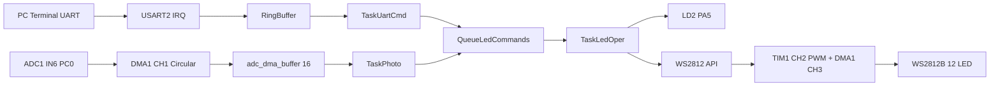
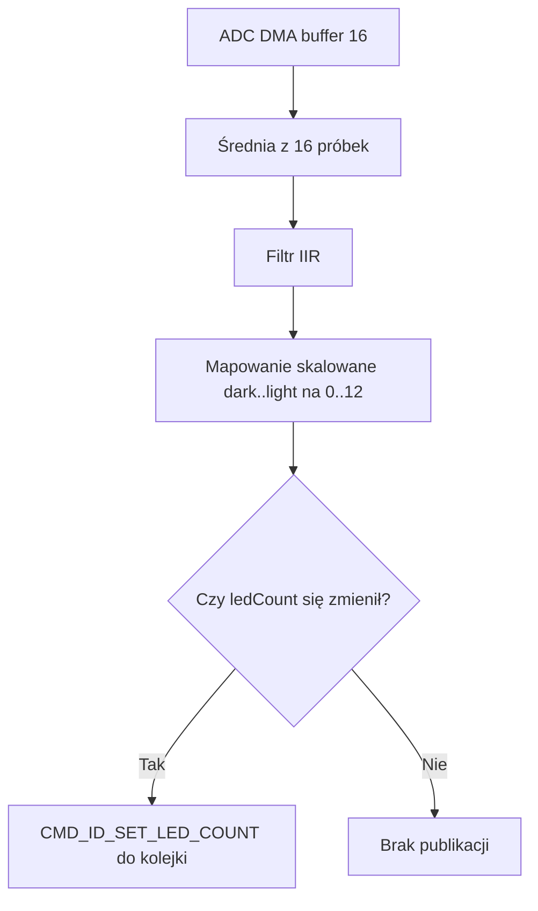
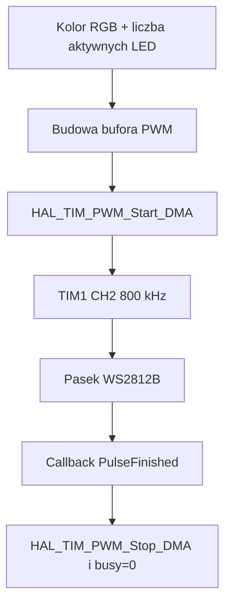

# RTOS - Sterowanie diodami WS2812b przy wykorzystaniu ADC,DMA,PWM oraz interpretera UART.

| Autor | Nr albumu |
|---|---|
| Mateusz Kowalczyk | 268533 |

## 1. Cel projektu

Celem projektu jest zbudowanie systemu na STM32F303RE (FreeRTOS), który:

- odbiera komendy tekstowe przez UART,
- steruje lokalną diodą LD2,
- steruje paskiem WS2812B (12 diod RGB) przez TIM1 PWM + DMA,
- pobiera pomiar światła przez ADC1 + DMA,
- mapuje pomiar ADC na liczbę aktywnych diod paska,
- łączy wszystkie decyzje sterowania przez kolejkę FreeRTOS.

## 2. Jak działa program

### 2.1 Inicjalizacja

Po starcie programu wykonywane są kolejne kroki:

1. Inicjalizacja HAL i zegarów.
2. Inicjalizacja GPIO, DMA, USART2, ADC1, TIM1.
3. Start odbioru UART w trybie przerwań (1 bajt).
4. Start ciągłego pomiaru ADC z DMA do bufora 16 próbek.
5. Inicjalizacja sterownika WS2812B.
6. Start kernela FreeRTOS i utworzenie:
   - `TaskUartCmd` (wysoki priorytet),
   - `TaskLedOper` (niski priorytet),
   - `TaskPhoto` (niski priorytet),
    - `QueueLedCommands` (8 elementów po 12 bajtów).

### 2.2 Logika runtime

Program pracuje jako system zdarzeniowy:

- `TaskUartCmd` składa komendę tekstową i publikuje `CommandMessage` do kolejki.
- `TaskPhoto` co 100 ms liczy średnią z ADC, filtruje sygnał i przy zmianie publikuje nową liczbę LED do kolejki.
- `TaskLedOper` jako jedyny wykonuje decyzje: miganie LD2, zmiana koloru paska, zmiana liczby aktywnych diod.

Dzięki temu unika się konfliktu między źródłami poleceń (UART i ADC), bo obie ścieżki spotykają się w jednej kolejce.

## 3. Jak obsłużyć projekt (użytkownik)

### 3.1 Połączenie UART

- Parametry: `115200, 8N1`
- Zakończenie każdej komendy: średnik `;`
- `CR/LF` może występować po komendzie, ale nie kończy komendy logicznie

### 3.2 Odpowiedzi systemu

- Poprawna komenda sterująca: `OK\r\n`
- Poprawna kalibracja `SD;`: `OK DARK SET TO ADC VAL: <adc>;\r\n`
- Poprawna kalibracja `SL;`: `OK LIGHT SET TO ADC VAL: <adc>;\r\n`
- Błędna składnia / przepełnienie bufora komendy: `Syntax Error\r\n`

Uwaga: odpowiedzi po UART nadaje wyłącznie `UART_Task`.

### 3.3 Komendy realizowane w projekcie

| Komenda | Znaczenie | Efekt |
|---|---|---|
| `START LED;` | Start migania LD2 | LD2 miga co 500 ms |
| `STOP LED;` | Stop migania + wygaszenie paska | LD2 OFF, aktywne LED = 0 |
| `L,<R>,<G>,<B>;` | Ustawienie koloru RGB (0..255) | Kolor aktywnych diod WS2812B |
| `SD;` | Zapis punktu „ciemno” | Aktualny odczyt ADC staje się dolnym punktem skali (0 diod) |
| `SL;` | Zapis punktu „jasno” | Aktualny odczyt ADC staje się górnym punktem skali (12 diod) |

Przykłady:

```text
START LED;
STOP LED;
L,255,0,0;
L,0,255,0;
L,0,0,255;
SD;
SL;
```

Uwaga: parser przyjmuje dokładnie 3 wartości po `L,` (R,G,B), a wszystkie komendy muszą kończyć się średnikiem.

Uwaga kalibracyjna: po starcie systemu pasek WS2812B pozostaje wygaszony. Sterowanie liczbą aktywnych diod zaczyna działać dopiero po ustawieniu obu punktów kalibracyjnych (`SD;` i `SL;`).

## 4. Opis torów funkcjonalnych

### 4.1 Tor UART -> parser -> kolejka

1. Bajt przychodzi na USART2.
2. Callback `HAL_UART_RxCpltCallback` wrzuca bajt do `RingBuffer`.
3. `UART_Task` pobiera bajty i składa linię do pierwszego średnika `;`.
4. `parseCommand()` zamienia tekst na `CommandMessage`.
5. Komendy sterujące LED trafiają do `QueueLedCommands`.
6. Komendy `SD;` i `SL;` są obsługiwane bezpośrednio w `UART_Task` (zapis referencji kalibracji ADC).

### 4.2 Tor ADC -> filtracja -> mapowanie -> kolejka

1. ADC1 mierzy stale kanał IN6 (PC0).
2. DMA1_CH1 zapisuje próbki do `adc_dma_buffer[16]` (circular).
3. `Photo_Task` liczy średnią z 16 próbek.
4. Filtr IIR wygładza sygnał.
5. Wynik mapowany jest na zakres liczby diod `0..12` na podstawie punktów kalibracyjnych `dark` i `light`.
6. Przy zmianie wartości wysyłany jest `CMD_ID_SET_LED_COUNT`.

### 4.3 Kalibracja dla różnych pomieszczeń

Kalibracja pozwala dopasować działanie paska LED do warunków oświetleniowych otoczenia:

1. Ustaw czujnik w ciemnym punkcie pomieszczenia i wyślij `SD;`.
2. Ustaw czujnik w jasnym punkcie (maksymalne oświetlenie) i wyślij `SL;`.
3. Program skaluje kolejne odczyty ADC liniowo między tymi punktami.

Efekt:

- dla poziomu „ciemno” i poniżej świeci 0 diod,
- dla poziomu „jasno” świeci 12 diod,
- wartości pośrednie wypełniają pełne spektrum paska w danym pomieszczeniu.

### 4.4 Tor wykonawczy LED

`LED_Task` odbiera komunikaty z kolejki i wykonuje:

- `CMD_ID_START_LED` -> włącza miganie LD2,
- `CMD_ID_STOP_LED` -> zatrzymuje miganie i gasi pasek,
- `CMD_ID_SET_LED` -> ustawia kolor,
- `CMD_ID_SET_LED_COUNT` -> ustawia liczbę aktywnych diod.

Sam sygnał do paska generowany jest przez TIM1 PWM + DMA1_CH3.

## 5. Diagramy Mermaid

### 5.1 Architektura całości



### 5.2 Sekwencja komendy UART

```mermaid
sequenceDiagram
    participant U as Użytkownik
    participant I as USART2 IRQ
    participant R as RingBuffer
    participant T as UART_Task
    participant P as parseCommand
    participant Q as QueueLedCommands
    participant L as LED_Task

    U->>I: "L,255,0,0;"
    I->>R: push(byte)
    T->>R: pop(byte)
    T->>P: parseCommand(cmd)
    alt komenda poprawna
        P-->>T: CommandMessage
        T->>Q: osMessageQueuePut
        T-->>U: OK\r\n
        L->>Q: osMessageQueueGet
        L->>L: wykonanie CMD_ID_SET_LED
    else komenda kalibracji
        T->>T: SD; lub SL; -> zapis referencji ADC
        T-->>U: OK DARK/LIGHT SET TO ADC VAL: ...;\r\n
    else błąd składni
        P-->>T: CMD_ID_UNKNOWN
        T-->>U: Syntax Error\r\n
    end
```

### 5.3 Przetwarzanie ADC



### 5.4 Generacja sygnału WS2812B



## 6. Kluczowe fragmenty kodu (listingi)

### 6.1 Parser komendy RGB

```cpp
if (cmd[0] == 'L' && cmd[1] == ',')
{
    char buffer[32];
    strncpy(buffer, cmd, sizeof(buffer) - 1);
    buffer[sizeof(buffer) - 1] = '\0';

    size_t len = strlen(buffer);
    if (len == 0 || buffer[len - 1] != ';')
    {
        return msg;
    }

    buffer[len - 1] = '\0';

    char* token = strtok(buffer, ",");
    if (token == nullptr || strcmp(token, "L") != 0)
    {
        return msg;
    }

    uint8_t values[3];
    for (uint8_t i = 0; i < 3; i++)
    {
        token = strtok(nullptr, ",");
        if (token == nullptr || parseUint8(token, &values[i]) == 0)
        {
            return msg;
        }
    }

    token = strtok(nullptr, ",");
    if (token != nullptr)
    {
        return msg;
    }

    msg.id = CMD_ID_SET_LED;
    msg.led.red = values[0];
    msg.led.green = values[1];
    msg.led.blue = values[2];
    return msg;
}
```

### 6.2 Mapa ADC -> liczba LED

```cpp
static uint8_t mapAdcToLedCount(uint16_t adcValue)
{
    if ((photo_dark_ref_set == 0U) || (photo_light_ref_set == 0U))
    {
        return 0U;
    }

    uint16_t darkRef = photo_adc_dark_ref;
    uint16_t lightRef = photo_adc_light_ref;

    if (lightRef <= darkRef)
    {
        lightRef = darkRef + 1U;
    }

    if (adcValue <= darkRef)
    {
        return 0U;
    }

    if (adcValue >= lightRef)
    {
        return WS2812_LED_COUNT;
    }

    uint32_t span = static_cast<uint32_t>(lightRef - darkRef);
    uint32_t relative = static_cast<uint32_t>(adcValue - darkRef);

    uint8_t mapped = static_cast<uint8_t>((relative * WS2812_LED_COUNT) / span);

    if (mapped == 0U)
    {
        mapped = 1U;
    }

    return mapped;
}
```

### 6.3 Obsługa `SD;` i `SL;` w `UART_Task`

```cpp
if (msg.id == CMD_ID_SET_DARK_REF)
{
    uint16_t adcNow = photo_adc_raw;
    char response[80];

    photo_adc_dark_ref = adcNow;
    photo_dark_ref_set = 1U;

    if (photo_adc_light_ref <= adcNow)
    {
        photo_adc_light_ref = (adcNow < ADC_MAX_VALUE) ? (adcNow + 1U) : ADC_MAX_VALUE;
    }

    int len = snprintf(response, sizeof(response),
                       "OK DARK SET TO ADC VAL: %u;\r\n",
                       (unsigned int)adcNow);
    uartSendFormatted(response, len);
}
else if (msg.id == CMD_ID_SET_LIGHT_REF)
{
    uint16_t adcNow = photo_adc_raw;
    char response[80];

    photo_adc_light_ref = adcNow;
    photo_light_ref_set = 1U;

    if (photo_adc_light_ref <= photo_adc_dark_ref)
    {
        photo_adc_dark_ref = (photo_adc_light_ref > 0U) ? (photo_adc_light_ref - 1U) : 0U;
    }

    int len = snprintf(response, sizeof(response),
                       "OK LIGHT SET TO ADC VAL: %u;\r\n",
                       (unsigned int)adcNow);
    uartSendFormatted(response, len);
}
```

### 6.4 Publikacja zmian z Photo_Task

```cpp
if (ledCount != lastLedCount)
{
    CommandMessage msg = {};

    msg.id = CMD_ID_SET_LED_COUNT;
    msg.adcRaw = adcFiltered;
    msg.ledCount = ledCount;

    osMessageQueuePut(QueueLedCommandsHandle, &msg, 0, 0);

    lastLedCount = ledCount;
}
```

### 6.5 Kodowanie bitów WS2812B do PWM

```cpp
static void putByteToBuffer(uint8_t byte, uint16_t *buffer, uint16_t *index)
{
    for (int8_t bit = 7; bit >= 0; bit--)
    {
        if ((byte & (1U << bit)) != 0U)
        {
            buffer[*index] = WS2812_PWM_ONE;
        }
        else
        {
            buffer[*index] = WS2812_PWM_ZERO;
        }

        (*index)++;
    }
}
```

### 6.6 Start transmisji TIM1 PWM DMA

```cpp
HAL_StatusTypeDef status = HAL_TIM_PWM_Start_DMA(&htim1,
                                                 TIM_CHANNEL_2,
                                                 (uint32_t*)ws2812_pwm_buffer,
                                                 WS2812_BUFFER_SIZE);

if (status != HAL_OK)
{
    ws2812_busy = 0;
}
```

## 7. Parametry i stale projektu

| Parametr | Wartość |
|---|---|
| Liczba diod WS2812B | 12 |
| UART | 115200, 8N1 |
| ADC rozdzielczość | 12 bit (0..4095) |
| Rozmiar bufora ADC DMA | 16 próbek |
| Okres Photo_Task | 100 ms |
| Miganie LD2 | 500 ms |
| TIM1 ARR | 89 |
| Częstotliwość sygnału WS2812B | ok. 800 kHz |
| Komendy tekstowe | kończone `;` |
| Stan po starcie | LED wygaszone do czasu wykonania `SD;` i `SL;` |
| Referencje inicjalne | `dark=0`, `light=4095`, ale nieaktywne do czasu kalibracji |

## 8. Podsumowanie

Projekt realizuje kompletną architekturę sterowania wbudowanego:

- wejście tekstowe (UART),
- wejście analogowe (ADC + DMA),
- wykonanie czasokrytyczne (WS2812B przez PWM + DMA),
- synchronizacja między modułami przez FreeRTOS queue.

Najważniejsza cecha rozwiązania to rozdzielenie odpowiedzialności:

- ISR jest lekkie,
- taski produkują zdarzenia,
- jeden task wykonuje sterowanie LED.

Dzięki temu kod jest czytelny, łatwy do rozbudowy i odporny na konflikty między różnymi źródłami komend.
